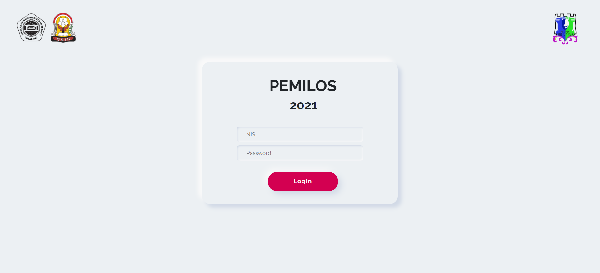
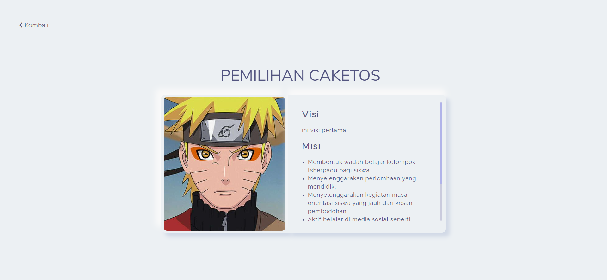
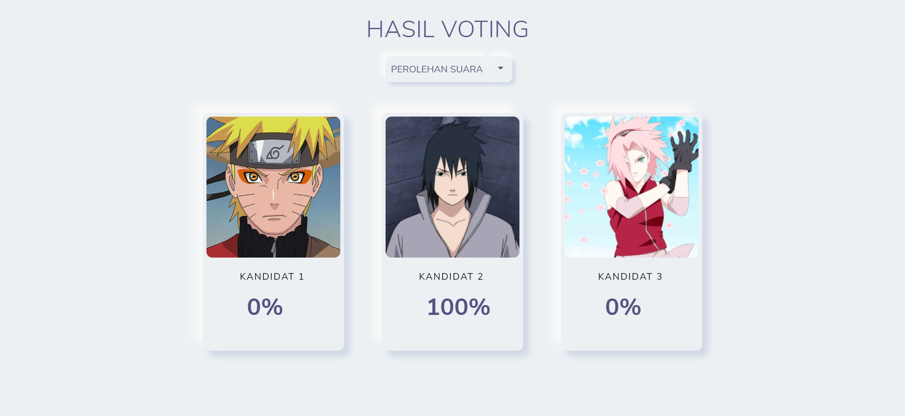

# Laralos 

Laravel for pemilos
<p align="center"><a href="https://laravel.com" target="_blank"></a></p>

<p align="center">
<a href="https://travis-ci.org/laravel/framework"></a>
<a href="https://packagist.org/packages/laravel/framework"></a>
<a href="https://packagist.org/packages/laravel/framework"></a>
<a href="https://packagist.org/packages/laravel/framework"></a>
</p>

## About Laravel

Laravel is a web application framework with expressive, elegant syntax. We believe development must be an enjoyable and creative experience to be truly fulfilling. Laravel takes the pain out of development by easing common tasks used in many web projects, such as:

- [Simple, fast routing engine](https://laravel.com/docs/routing).
- [Powerful dependency injection container](https://laravel.com/docs/container).
- Multiple back-ends for [session](https://laravel.com/docs/session) and [cache](https://laravel.com/docs/cache) storage.
- Expressive, intuitive [database ORM](https://laravel.com/docs/eloquent).
- Database agnostic [schema migrations](https://laravel.com/docs/migrations).
- [Robust background job processing](https://laravel.com/docs/queues).
- [Real-time event broadcasting](https://laravel.com/docs/broadcasting).

Laravel is accessible, powerful, and provides tools required for large, robust applications.


## License

The Laravel framework is open-sourced software licensed under the [MIT license](https://opensource.org/licenses/MIT).


# Preview Laralos

<p align="center"></p>

<p align="center"></p>

<p align="center"></p>

<p align="center"></p>


# How To Install and Run laravel sail?

!important!

## Installation

1) Dipastikan connect dengan internet

2) Os base on linux atau Windows WSL

3) Install [git](https://git-scm.com/downloads/)  & [composer](https://getcomposer.org)

4) Download sc ini menggunakan command
   ```bash
   git clone https://github.com/adzkyyy/web-pemilos.git 
   ``` 

5) Enable atau install extension php yang dibutuhkan untuk composer

6) Install [docker](https://docs.docker.com/engine/install) & [docker-compose](https://docs.docker.com/compose/install), untuk windows menggunakan docker desktop

7) Pastikan untuk setup grup docker pada user
   ```bash
   sudo usermod -aG docker $USER
   ```

8) Install dependencies
   ```bash
   cd web-pemilos && composer install
   ```

9) Membuat alias path untuk binary sail
   ```bash
   echo "alias sail='vendor/bin/sail'" > ~/.bash_aliases && source ~/.bash_aliases
   ```

10) Copy file .env.example menjadi .env untuk settingan konfigurasi, lalu untuk database diubah menjadi
    ```bash
    DB_CONNECTION=mysql
    DB_HOST=mysql
    DB_PORT=3306
    DB_DATABASE=web_pemilos
    DB_USERNAME=sail
    DB_PASSWORD=password
    ``` 


## Running

1) Dipastikan untuk connect ke internet untuk menginstall image dari registry  

2) Masuk ke directory web-laravel dan ketik command
   ```bash
   sail up -d 
   ```

3) Generate key
   ```bash
   sail php artisan key:generate
   ```

4) Migration database
   ```bash
   sail php artisan migrate:fresh --seed
   ```

5) Aplikasi pemilos bisa dibuka pada http://localhost

TERIMA KASIH

Created by Muhammad Zaky Adzkiya & Sabrina Aska Amalina
